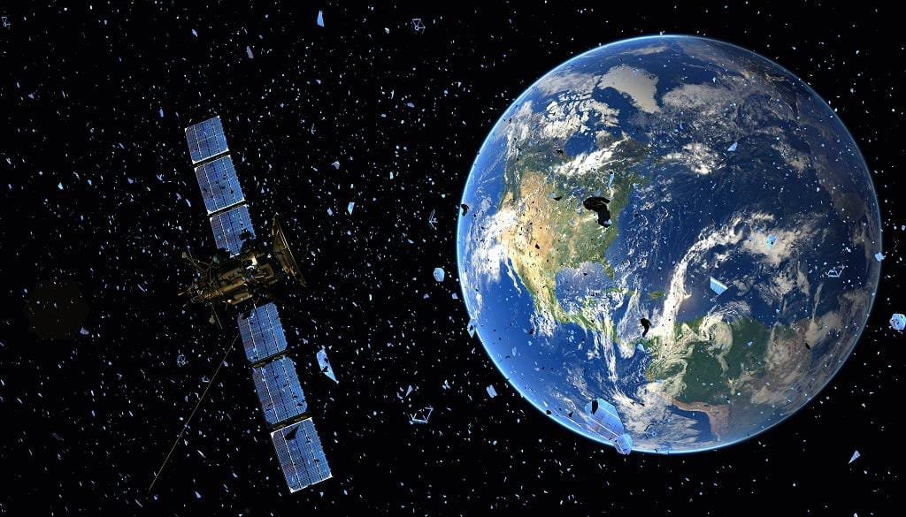
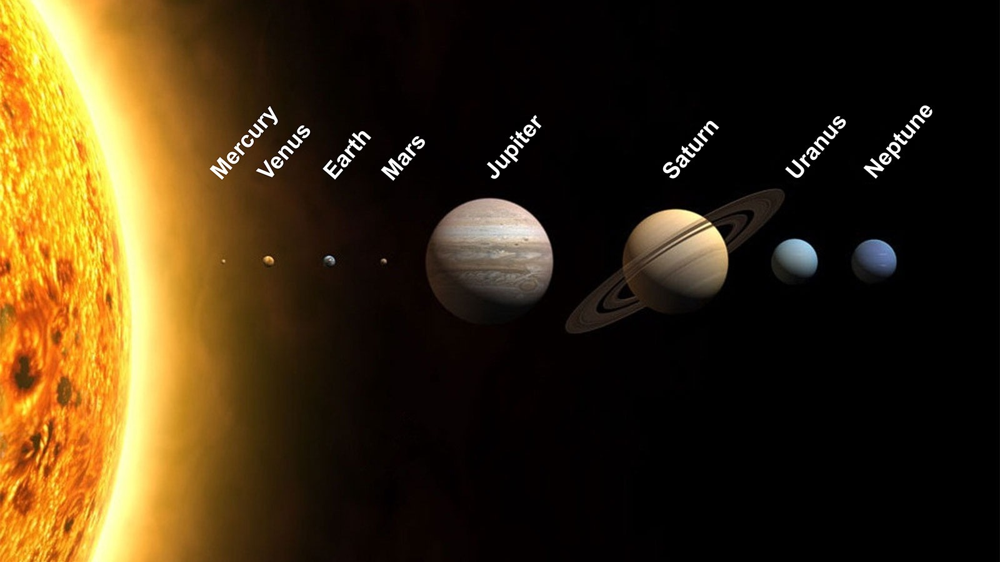

<!-- which  -->
# SolAR - Marker Based Solar System
 
This was a freelancing project, which helps the user to have a look of the Solar System along with the planets by scanning the AR Based Markers.
 
## INSTRUCTIONS TO USE OUR PROJECT

Our project is built on unity version 2021, which is a 3D/2D game engine and powerful cross-platform IDE for developers. And it is rendered using WebGL which is a JavaScript for rendering high-performance 2D and 3D graphics within any compatible web browser.

One can easily have a look to the project by downloading the base.apk file in the repo and after downloading the file , open the camera to scan the marker.

Things we have done in making this projects are:- 
->Importing the packages from Vuforia  
->Attaching the desired models along with theirpackages in Unity  
->Designing the all components of Solar System and making animations for the models and finally deploying it.  

## Demo
# Download the app from the repo (base.apk)

## Markers

## Demo Video : 

